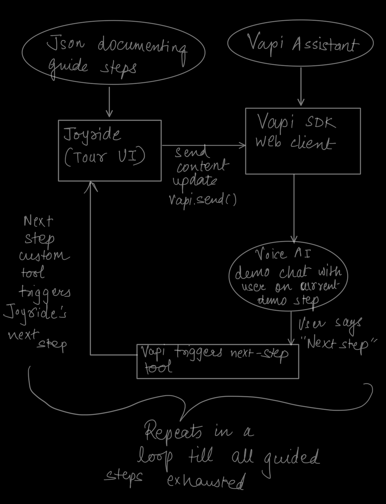
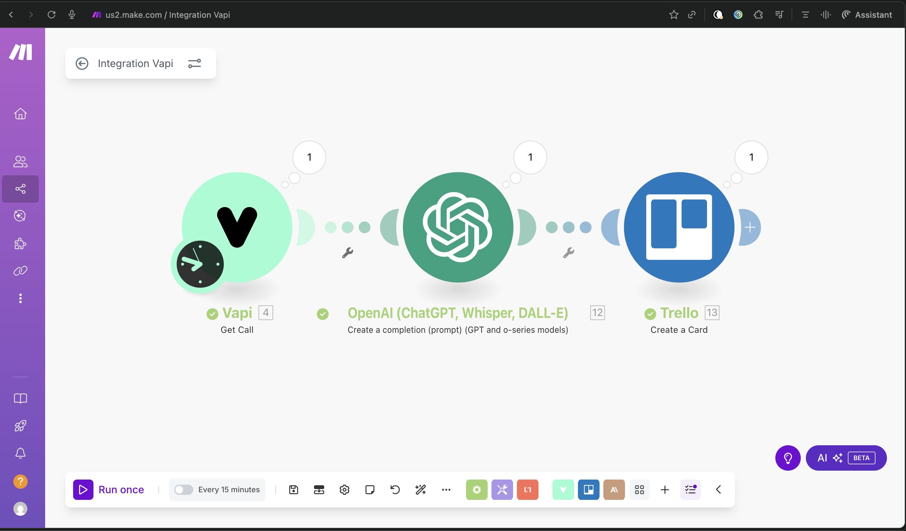
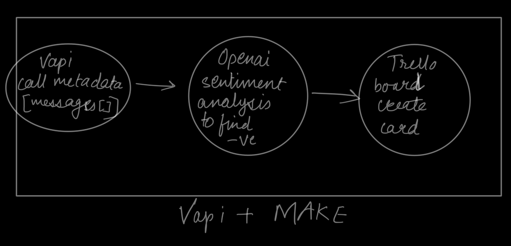

## Voice-Guided Onboarding with VAPI + Joyride: From Static Tours to Agentic Flows

Aug 8 2025

This app demonstrates practically how voice-first and agentic applications can cross a threshold in browser productivity using Vapi: instead of forcing users to read static tooltips in onboarding tours or bounce between a YouTube video and your app, a voice agent can guide them in place. By pairing a UI tour engine (Joyride) with a voice layer  (Vapi Web Client) and lightweight analytics (Make), you can ship self-guided onboarding that feels like a product demo welcoming users in. But most importantly, this engine creates a data warehouse of rich actionable feedback extracted from natural conversation between users, and vapi assistants. This feedback can help a product grow quickly, and effectively without waiting for specific user feedback. This feedback also outperforms user interaction tracking telemetry like number of button-clicks due to the availability of natural conversation.
The voice-tour-sdk aims to work as an independent SDK implementation that can be used on top of any browser to quickly add Product onboarding to it. 

NOTE: The current SDK implementation has not fully developed the Agentic layer but merely highlights the momentous value of combining Agentic flows with voice AI for product onboarding, and automated feedback gathering.

This guide walks through a practical approach to build a voice-guided tour that:
- Explains features conversationally
- Navigates tutorial steps hands-free using a Custom Tools feature provided by Vapi that can trigger a voice assistant to take any custom action based on my usecase.
- Streams per-step UI context to the Vapi voice assistant through its rich web APIs
- Captures call logs and transcripts for sentiment and insight analysis via VAPI's detailed call logs that include transcript with Make


## What is a voice-guided tour?

A voice-guided tour merges a UI spotlight system (Joyride) with a voice assistant (VAPI). You can think of Vapi assistants as a customizable voice agent that performs a specific role. The agent can call tools, as well as speak in a certain voices and temperament. The agent can have its personalized system prompt with modefiable LLM and Voice providers. Vapi also provides an easy-to-use [STT-LLM-TTS (Speech-to-text, LLM, Text-to-Speech) toolkit](https://docs.vapi.ai/quickstart/introduction) with a lot of flexibility, and integrations. Joyride controls step visuals (targets, spotlight), while Vapi streams guidance and listens for commands. Each time a step changes, the app sends a short system message (selector + docs) to the Vapi voice assistant. The assistant explains the current feature and can move on to next tutorial steps via a Custom Vapi Tool.

## Practical App Overview

We will build a voice tour that:
- Uses Joyride to spotlight UI elements across steps
- Sends per-step system context to the voice assistant
- Allows users to say “next step” (Custom Vapi Tool: `NextStep`) to advance the tour
- Forwards lightweight analytics events to a Make webhook for aggregation, insights, and Trello card creation

## Output

- A working, voice-guided onboarding demo:
  - Tour steps defined in JSON
  - Voice assistant that explains each step and can advance hands-free
  - Optional analytics buffer posting to a Make webhook
  - VAPI call logs and transcripts available for analysis (sentiment, themes)

## Goal

Given a set of product tutorial steps (`id`, `selector`, `docs`), build a conversational tour that:
- Highlights each UI element in sequence
- Streams relevant context to the assistant on each step
- Enables hands-free navigation via a Custom Tool (`NextStep`)
- Captures analytics and transcripts for insights

### Steps

1. Define tour steps
2. Bind Joyride to a controller that emits `step:viewed`
3. On each `step:viewed`, send per-step context to the assistant
4. Start voice and listen for transcript or Custom Tool `NextStep`
5. When triggered, advance Joyride and loop back to step context
6. Buffer and forward analytics events to Make

### Tech Stack

- **Vapi Web Client**: Voice layer for speech in/out and Custom Tools
- **React Joyride**: Tour UI (steps, spotlight, step progress)
- **TypeScript + React + Vite**: Frontend app
- **Make (webhook)**: Optional lightweight analytics aggregation
- **Voice Tour SDK (glue)**: Bridges Joyride events and VAPI context/tools that can be reused to create a demo tutorial for any webapp

## Getting Started

Install dependencies:

```bash
pnpm install
pnpm -F trellify-demo install
```

Configure environment:

```bash
cp apps/trellify-demo/.env.example apps/trellify-demo/.env
# Fill in
# VITE_VAPI_ASSISTANT_ID=asst_xxx
# VITE_VAPI_PUBLIC_API_KEY=pk_xxx
# (optional) VITE_MAKE_WEBHOOK_URL=https://hook.integromat.com/xxx
```

Run the demo:

```bash
pnpm -F trellify-demo dev
```

Open `http://localhost:5173` and click Start Tour.

## Define Steps

Tour steps are defined as JSON with `id`, `selector`, and `docs`.

```json
[
  { "id": "board", "selector": "#board", "docs": "This board shows lists (columns) with cards. Drag-and-drop to reorder." },
  { "id": "new-card", "selector": "#new-card-btn", "docs": "Create a new card. Add title, labels, and due date." },
  { "id": "filters", "selector": "#filters", "docs": "Filter cards by label, assignee, or due date." },
  { "id": "settings", "selector": "#board-settings", "docs": "Board preferences like backgrounds and members." }
]
```

## Bind Joyride and Start the Voice Tour

Bind Joyride’s callback to emit step events, and start the tour/voice session. Note the brace style used in functions and control blocks.

```ts
import { createVoiceTour, type VoiceTourStep } from "voice-tour-sdk";

export function useVoiceTour(steps: VoiceTourStep[])
{
  const tour = createVoiceTour(
  {
    vapi: { mode: "web-widget", assistantId: "asst_xxx" },
    steps,
    analytics: { makeWebhookUrl: import.meta.env.VITE_MAKE_WEBHOOK_URL },
    voice: { autoStartOnFirstStep: false, publicKey: import.meta.env.VITE_VAPI_PUBLIC_API_KEY }
  } as any);

  useEffect(() =>
  {
    tour.start();
    return () => tour.stop();
  }, [tour]);

  return tour;
}
```

In your app component, wire Joyride to the controller and handle voice-driven next via a custom event.

```tsx
export default function App()
{
  const steps: VoiceTourStep[] = useMemo(() => stepsData as VoiceTourStep[], []);
  const tour = useVoiceTour(steps);

  const [stepIndex, setStepIndex] = useState(0);
  const isManualAdvance = useRef(false);
  const lastAdvanceTime = useRef(0);

  useEffect(() =>
  {
    const handleNextStep = () =>
    {
      const now = Date.now();
      if (now - lastAdvanceTime.current < 500)
      {
        return;
      }
      lastAdvanceTime.current = now;
      isManualAdvance.current = true;
      setStepIndex((prev) => Math.min(prev + 1, steps.length - 1));
    };

    window.addEventListener('voice-tour:next', handleNextStep);
    return () =>
    {
      window.removeEventListener('voice-tour:next', handleNextStep);
    };
  }, [steps.length]);

  const handleJoyride = tour.bindJoyride((data) =>
  {
    const finished = [STATUS.FINISHED, STATUS.SKIPPED];
    if (finished.includes(data.status))
    {
      return;
    }
    if (typeof data.index === "number" && !isManualAdvance.current)
    {
      if (data.action === 'next' || data.action === 'prev' || data.action === 'start')
      {
        setStepIndex(data.index);
      }
      playChime();
    }
    if (isManualAdvance.current)
    {
      isManualAdvance.current = false;
    }
  });

  return (
    <Joyride steps={steps.map((s) => ({ target: s.selector, content: s.docs }))}
             stepIndex={stepIndex}
             run={true}
             callback={handleJoyride} />
  );
}
```

## How Joyride and VAPI integrate

At a high level:
- Joyride controls UI spotlight and step index
- The controller binds Joyride’s callback to emit `step:viewed`
- On `step:viewed`, the controller sends a short per-step system message (selector + docs) to the Vapi assistant
- The assistant speaks guidance and can advance steps via a Custom Vapi Tool

Per-step context message (system role) sent to VAPI:

```ts
function sendContextForStep(step: VoiceTourStep)
{
  const contextMessage = `You are now guiding the user through step "${step.id}".\n\n` +
    `Current step information:\n` +
    `- Element: ${step.selector}\n` +
    `- Context: ${step.docs}\n\n` +
    `Please explain this feature and ask if they'd like to proceed.`;

  webClient.send(
  {
    type: "add-message",
    message:
    {
      role: "system",
      content: contextMessage
    }
  });
}
```

## Voice-Driven Navigation with Custom Tools

There are two paths to advance the tour hands-free:
- A transcript phrase match (e.g., “Let’s head on over to the next step.”)
- A Custom Tool invocation from the assistant (`NextStep`)

When either is detected, the glue code dispatches a UI event that advances Joyride:

```ts
if (message.type === 'transcript' && message.role === 'assistant' && message.transcript === "Let's head on over to the next step.")
{
  window.dispatchEvent(new CustomEvent('voice-tour:next'));
}

if (message.type === 'function-call' && message.functionCall?.name === 'NextStep')
{
  window.dispatchEvent(new CustomEvent('voice-tour:next'));
}
```

Example Custom Tool schema used by your VAPI assistant configuration:

```json
{
  "name": "NextStep",
  "description": "Advance the product tour to the next step",
  "parameters": {
    "type": "object",
    "properties": {},
    "required": []
  }
}
```

Flow summary:
- Joyride step → send context → assistant explains
- User says “next” or model triggers `NextStep` → UI event → Joyride advances
- Repeat for each step



## Analytics via Make

Lightweight client-side analytics can be buffered and forwarded to a Make webhook for aggregation. Events include: `viewed_step`, `asked_question`, `tour_completed`, and `voice_started_manually`.
The current implementation uses Make's Dashboard for manually triggering the analytics & trello card generation pipeline.


VAPI layer gives you call logs and transcripts; combine them with OpenAi for sentiment analysis, and extracting negative actionable feedback; Send this feedback to Trello layer for a card generation.





## End-to-End Sequence (Text Diagram)

- Joyride activates step → Controller emits `step:viewed`
- Controller sends per-step system message (selector + docs) → VAPI
- Assistant speaks guidance to user
- User says “next” → transcript match or Custom Tool `NextStep`
- VAPI emits event → Controller dispatches `voice-tour:next`
- App increments `stepIndex` → Joyride advances → loop continues
- Optional: analytics `viewed_step` → buffered → Make webhook

## Potential Applications

- Interactive onboarding for SaaS dashboards and dev tools
- Voice-first product tours for accessibility and reduced screen strain caused by reading digital documentation
- In-product automated, interactive, agentic, and enabling voice AI training replacing verbose digital tutorial videos/docs
- Hands-free workflows for complex enterprise apps
- Sales demos that adapt to the prospect’s spoken questions
- Creating a data warehouse of actionable feedback through natural onboarding conversation

## Target Users

- **Solo founders & small teams**: ship voice-first onboarding in hours, not weeks
- **Product & Growth teams**: A/B tour scripts, measure completion, iterate faster
- **Customer Education/Success**: guide users in-app, reduce support tickets
- **Enterprise UX teams**: accessible, low-friction onboarding at scale

## Getting It Production-Ready

- Harden transcript triggers: prefer Custom Tools over phrase matching
- Add `goto(stepId)` tool for non-linear navigation
- Enrich context (titles, screenshots) per step for richer explanations
- Integrate server-side analytics using VAPI call logs + Call Analysis

## Execute

Run locally:

```bash
pnpm -F trellify-demo dev
```

Ship behind feature flags and progressively roll out to cohorts. Measure completion and sentiment; iterate scripts quickly—steps are just JSON.

## Next Steps

- Add more Custom Tools: `PrevStep`, `GoToStep`, `OpenPanel`, domain-specific actions
- Join Make analytics with VAPI call logs + app telemetry for deeper funnels
- Explore agentic flows: chain tools to perform multi-step tasks on request

## Further Reading

- vapi-custom-tools: [Custom Tools](https://docs.vapi.ai/tools/custom-tools)
- vapi-sdk: [Vapi Web Client SDK](https://github.com/VapiAI/client-sdk-web)
- vapi + make: [Vapi meets Make](https://vapi.ai/blog/vapi-meets-make)
- react joyride: [React Joyride](https://react-joyride.com/)

## Call to Action

Ready to ship a voice-guided tour? Spin up the demo, add a `NextStep` tool via the Vapi dashboard’s Custom Tools, and try advancing steps hands-free. Then iterate on your `steps.json` and scripts to fit your product.

## Conclusion

The  voice-tour-sdk layer demonstrates how to turn static onboarding tours into conversational, agentic onboarding using Joyride + VAPI + Make. Define steps, bind a callback, stream context, and let a Custom Tool advance the UI. With call logs, transcripts, and buffered analytics, you can ship voice-first onboarding that teaches users faster—without more screen time.

 
